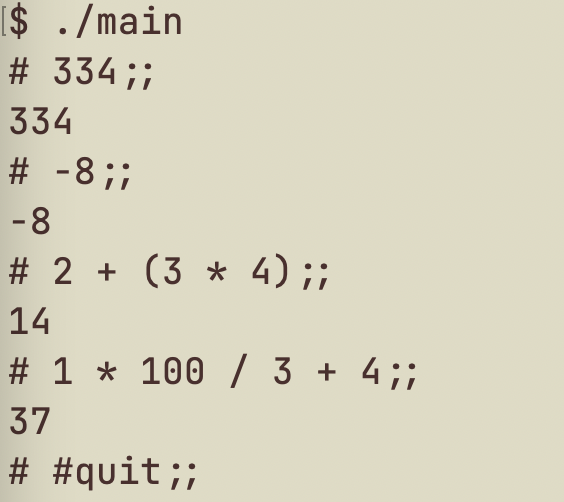

### 算術式計算REPL

#### 使い方
- `make` を実行して実行可能ファイル`main`を作ってください。
- `./main`で算術式計算のREPLを起動してください。
- "*算術式*;;" の後に改行を入力すると計算結果が得られます。
- REPL を終了するには #quit;; と入力してください。

#### 算術式の定義
E = i | E + E | E - E | E * E | E / E | - E | (E)

(iは整数を表す)

#### 算術式の例
- 334
- -8
- 2 + (3 * 4)
- 1 * 100 / 3 + 4

